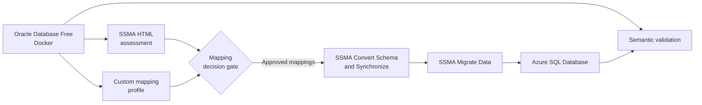

# Oracle to Azure SQL Database Migration with SSMA

This demo migrates a synthetic Oracle sales table to Azure SQL Database with
[SQL Server Migration Assistant (SSMA) for Oracle](https://aka.ms/ssmafororacle).
It adds a custom assessment before schema conversion so `DATE`, `NUMBER`, and
`CHAR` mappings are based on actual values instead of assumptions.

## What the demo proves

- Oracle `DATE` includes time. `datetime2(0)` preserves it; mapping to `date`
  is treated as a lossy business decision.
- Declared `NUMBER(p,s)` values retain precision and scale. Unconstrained
  `NUMBER` is profiled and mapped to an exact decimal instead of the SSMA
  `float(53)` default.
- Fixed-width `CHAR(n)` semantics are preserved by default. A targeted
  `varchar(n)` mapping requires explicit padding validation and remediation.
- SSMA remains responsible for assessment, schema conversion, synchronization,
  and data migration.

## Architecture



## Prerequisites

- Windows 10/11 for the SSMA desktop experience.
- Python 3.11 or later.
- Docker Desktop with at least 4 GB available memory.
- [SSMA for Oracle](https://aka.ms/ssmafororacle).
- A supported Oracle client/provider required by your SSMA version.
- ODBC Driver 18 for SQL Server for the optional validation CLI.
- An existing Azure SQL Database reachable from the SSMA workstation. The
  included Entra-only Bicep creates a private-only target; use an approved
  private endpoint, VPN, or network security perimeter path to reach it.

Run the local prerequisite check:

```powershell
.\scripts\check-prerequisites.ps1
```

## Demo execution walkthrough

Each step has a verification point. Do not continue when its expected result is
missing.

### 1. Clone and configure the repository

```powershell
git clone https://github.com/salavala/oracle-to-azure-sql-migration-demo.git
Set-Location oracle-to-azure-sql-migration-demo
Copy-Item .env.example .env
```

Edit `.env` and set strong local-only values for `ORACLE_SYSTEM_PASSWORD` and
`ORACLE_PASSWORD`. Set `AZURE_SQL_SERVER` and `AZURE_SQL_DATABASE` to an
existing Entra-enabled target.

**Why:** `.env` is ignored by Git, keeping credentials and environment-specific
endpoints out of source control.

### 2. Install the assessment utility

```powershell
python -m venv .venv
.\.venv\Scripts\Activate.ps1
python -m pip install --upgrade pip
python -m pip install -e ".[dev]"
```

**Why:** An isolated environment installs the Oracle profiler and Azure SQL
validator without modifying the system Python installation.

**Expected:** `oracle-azure-migrate --help` lists `demo-assess`, `assess`, and
`validate`.

### 3. Preview the custom-mapping assessment offline

```powershell
oracle-azure-migrate demo-assess
```

**Why:** The checked-in metadata and profile fixtures let the presenter explain
the decision logic before any database is running.

**Expected highlights:**

- `ORDER_DATE DATE -> datetime2(0)` is safe.
- `SHIP_DATE DATE -> date` is a **BLOCKER** because sample values contain time.
- `UNBOUNDED_SCORE NUMBER -> decimal(20,6)` warns about SSMA's `float(53)`
  default.
- `LEGACY_REFERENCE CHAR(12) -> varchar(12)` requires padding review.

### 4. Start the Oracle source

```powershell
docker compose up -d --wait
docker compose ps
```

**Why:** Oracle Database Free creates the `MIGRATION_DEMO` user and loads four
rows designed to expose precision, time, and padding problems.

**Expected:** `oracle-migration-demo` reports `healthy`. Initial image download
and database creation can take several minutes.

### 5. Run the official SSMA assessment

1. Open SSMA for Oracle.
2. Create a project with **Azure SQL Database** as the target.
3. Connect to `localhost:1521/FREEPDB1`.
4. Select `MIGRATION_DEMO`.
5. Right-click the schema and select **Create Report**.
6. Review and save the HTML report.

**Why:** This is Microsoft's supported compatibility assessment for Oracle
objects and code. It identifies conversion errors and warnings that value
profiling alone cannot find.

**Expected:** The report inventories `MIGRATION_DEMO.SALES_ORDERS` and shows its
conversion status.

### 6. Run the custom mapping assessment

```powershell
.\scripts\run-custom-assessment.ps1
```

Open `reports/custom-mapping-assessment.md`.

**Why:** SSMA's schema report sees declared types. This additional assessment
profiles actual values and compares inherited SSMA mappings with the desired
policy.

**Decision gate:** Resolve every `BLOCKER`. For this demo, either:

- Keep `SHIP_DATE` as `datetime2(0)` to preserve all source values, or
- Obtain explicit business approval to discard shipment times and retain the
  `SHIP_DATE -> date` object-level override.

### 7. Configure custom type mappings in SSMA

1. Open **Tools > Project Settings > Type Mapping**.
2. Confirm project-level `DATE -> datetime2(0)`.
3. Select `MIGRATION_DEMO > Tables > SALES_ORDERS`.
4. Open the table's **Type Mapping** tab.
5. Apply the approved `NUMBER` and length-specific `CHAR` overrides:

| Column | Oracle | Azure SQL | Scope and rationale |
|---|---|---|---|
| `UNBOUNDED_SCORE` | Unconstrained `NUMBER` | `decimal(20,6)` | Table-level source signature; exact profiled range |
| `LEGACY_REFERENCE` | `CHAR(12)` | `varchar(12)` | Table-level mapping bounded to source length 12 |

**Why:** SSMA mapping inheritance supports safe project defaults plus narrow
object-level exceptions. This avoids changing unrelated columns globally.

SSMA mappings match source types within the selected scope; they do not select
one column by name. Because this table has two Oracle `DATE` columns, do not
apply a table-wide `DATE -> date` rule.

### 8. Convert and inspect the schema

1. Connect SSMA to Azure SQL Database using Microsoft Entra authentication.
2. Map Oracle schema `MIGRATION_DEMO` to Azure SQL schema `dbo`.
3. Right-click the Oracle schema and select **Convert Schema**.
4. If Step 6 approved discarding shipment times, edit only the converted
   `SHIP_DATE` target column to `date`. Otherwise leave it as `datetime2(0)`.
5. Inspect the generated Azure SQL table and SSMA Error List.

**Why:** Conversion is still offline in the SSMA project. This is the last
review point before target DDL changes.

**Expected:** The converted `sales_orders` columns match the approved mapping
report.

### 9. Synchronize the target schema

In Azure SQL Database Metadata Explorer, right-click the target database and
select **Synchronize with Database**. Review the script, then apply it.

**Why:** Synchronization publishes the SSMA-generated schema to Azure SQL
Database independently from data movement.

**Expected:** `dbo.sales_orders` exists and is empty.

### 10. Migrate data with SSMA

Select `MIGRATION_DEMO.SALES_ORDERS` in Oracle Metadata Explorer and choose
**Migrate Data**. Supply source and target connections when prompted.

**Why:** SSMA moves the data using the converted schema and selected mappings.

**Expected:** The SSMA Data Migration Report shows four source rows and four
successfully migrated rows.

### 11. Validate migration semantics

Run `oracle/02_validate_source.sql` against Oracle and
`sql/validate_target.sql` against Azure SQL Database.

You can also run the row-count validator:

```powershell
az login
.\scripts\import-env.ps1
oracle-azure-migrate validate
```

**Why:** Successful row movement does not prove semantic equivalence. The
queries verify time retention, exact decimal totals, null behavior, and
fixed-width character values.

**Expected:** Four rows, an exact gross amount total of
`10000000124958.65`, and preserved `ORDER_DATE` time values.

### 12. Resolve retained CHAR padding when approved

If validation shows trailing spaces after the approved `CHAR(12) ->
varchar(12)` mapping, review and run:

```powershell
sqlcmd -S "$env:AZURE_SQL_SERVER" -d "$env:AZURE_SQL_DATABASE" `
  -G -N -i .\sql\normalize_legacy_reference.sql
```

**Why:** Changing the target type does not automatically prove that source
padding is semantically disposable. The remediation is deliberately separate
and auditable.

Rerun `sql/validate_target.sql` afterward.

### 13. Clean up the local source

```powershell
docker compose down
```

To also remove the local Oracle data volume:

```powershell
docker compose down --volumes
```

**Why:** The first command preserves the initialized demo for reuse. The second
removes all local demo data and forces a clean initialization next time.

## Optional Azure SQL provisioning

The Bicep creates a Basic 2-GB database with Entra-only authentication, TLS 1.2,
and public network access disabled. Deploy SSMA or provide a private endpoint
inside an approved private network before attempting migration.

```powershell
$principal = az ad signed-in-user show --query "{id:id,name:displayName}" |
    ConvertFrom-Json

azd env new oracle-sql-demo
azd env set AZURE_PRINCIPAL_ID $principal.id
azd env set AZURE_PRINCIPAL_NAME $principal.name
azd provision
```

Before provisioning, select and confirm the intended Azure subscription and
location and run the repository's Azure validation workflow.

## Repository layout

| Path | Purpose |
|---|---|
| `oracle/` | Source schema, edge-case data, and source validation |
| `ssma/` | SSMA mapping and migration workbench |
| `config/` | Desired mappings plus offline assessment fixtures |
| `src/oracle_azure_migrate/` | Live Oracle profiler and target validator |
| `sql/` | Azure SQL semantic validation and optional remediation |
| `infra/` | Optional Entra-only Azure SQL Bicep |
| `tests/` | Mapping, safety, DDL, assessment, and CLI tests |

## Safety notes

- Use synthetic data only.
- Never commit `.env`, SSMA connection files, passwords, or assessment reports
  containing production metadata.
- `normalize_legacy_reference.sql` changes migrated values; review its preview
  result and business approval before use.
- The included infrastructure does not enable the broad
  `Allow Azure services` firewall rule.

## Microsoft references

- [Oracle to Azure SQL Database migration guide](https://learn.microsoft.com/azure/azure-sql/migration-guides/database/oracle-to-sql-database-guide)
- [SSMA for Oracle](https://learn.microsoft.com/sql/ssma/oracle/sql-server-migration-assistant-for-oracle-oracletosql)
- [SSMA assessment report](https://learn.microsoft.com/sql/ssma/oracle/assessment-report-oracletosql)
- [SSMA type mapping](https://learn.microsoft.com/sql/ssma/oracle/mapping-oracle-and-sql-server-data-types-oracletosql)
